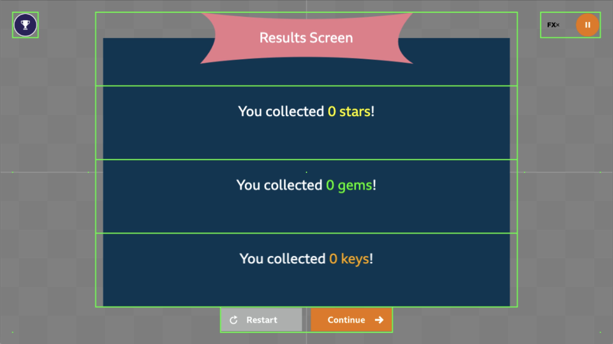
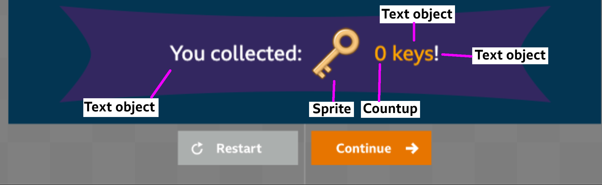
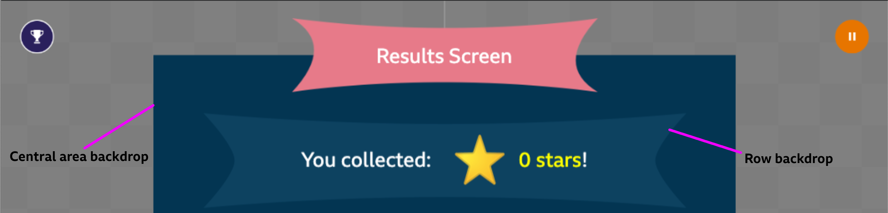

# Results Screen

## Rows

The results section of the results screen is split up into rows, defined in the theme config for the screen.  

Each row is given equal height, and objects inserted into rows are centered within each row by default.  

The content in the rows can be offset, for example, in the screenshot below, each text object has a y offset applied - which moves the text just above the center of each row.



You should keep to the recommended maximum of 4 rows, this is to ensure content is clearly visible on all devices. If you wish, you may have less than 4 rows - be aware that the title counts as a row.


## Examples

### Results Object Types



In the screenshot above, the row has been built using the following results objects:
- A text object containing the white text: "You collected:"
- A sprite object containing an image of  a key.
- A countup object which starts at 0 and counts up to the players key score.
- A text object containing the text: "key" or "keys" depending on whether the score is 1 or not.
- A text object containing the white text "!".

You may use a mixture of these objects to create each row of the results screen.  
By default, they will position and center themselves in the middle of their row. However, you may apply x and y offsets to each item in the row, if you choose to.

### Backdrops



You may add a central area backdrop by providing the correct image asset key, you can also set an alpha on this image.

Optionally, you can also add a backdrop to each row, this does not have to be the same image for each row.

## Example Config

Each row is defined in the array of rows, and the central area backdrop is defined as a backdrop object in the results config file.

**Results config file:**
```json
{
    theme: {
        results: {
            backdrop: { // this is the central area backdrop
                key: 'results.backdrop',
                alpha: 1,
            }
            rows: [Row object] // each row is defined in here
        }
    }
}
```

Within each row object, there is a format array, this is an array of text/sprite/countup objects that make up that row.

You may also add an optional backdrop object, set an alpha on the whole row, add a phaser tween transition for the row or add audio to be played.

**Row object:**
```json
 format: [ResultsText/Sprite/Countup object],
 backdrop: { //optional backdrop
    key: 'results.row-backdrop-1',
    alpha: 0.5,
    offsetY: -20,
    offsetX: 0
    },
 alpha: 1, //optional
 transition: {}, // optional phaser tween config object here,
 audio: { key: 'results.woosh', delay: 0 }, // optional row audio
```

To learn more on how to configure the objects in the format array, see the "Results Object Types" documentation below.

## Results Object Types

* [Text](./docs/results-screen/results-text.md)
* [Sprite](./docs/results-screen/results-sprite.md)
* [Countup](./docs/results-screen/results-countup.md)

## Frequently Asked Questions

